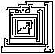

[](https://stand-with-ukraine.pp.ua)
# sxbp 

Experimental generation of 2D spiralling lines based on input binary data.

This is the command-line-interface for [libsxbp](https://github.com/saxbophone/libsxbp).

## Licensing

sxbp is released under version **3.0** of the **GNU Affero General Public License** (AGPLv3).

A full verbatim of this license may be found in the [LICENSE](LICENSE) file in this repository. *You should almost certainly read it*. If for some reason you have not received this file, you can view a copy of the license at [http://www.gnu.org/licenses/](http://www.gnu.org/licenses/).

Note that as well as being under the same copyleft protections as the GPL License, the AGPL enforces these protections further by **including provision of the software via a network service (such as a website) as one of its definitions of distribution**, hence requiring those who integrate sxbp into their website or other network service to also release the software into which they are integrating sxbp under this same license (AGPLv3).

> ### Note:

> I wholeheartedly don't recommend integrating *this* program into your software, that is what libsxbp is for. You can integrate sxbp anyway if you want, but it's generally not a good idea...

## Usage

Once sxbp is installed, run `sxbp -h` for usage information, or look here:

```
Usage: sxbp [-hvpgrD] [-i <file>] [-o <file>] [-f FORMAT] [-s <int>] [-S STRING] [-d <int>] [-l <int>] [-t <int>]
  -h, --help                       show this help and exit
  -v, --version                    show version of program and library, then exit
  -p, --prepare                    prepare a spiral from raw binary data
  -g, --generate                   generate the lengths of a spiral's lines
  -r, --render                     render a spiral to an image
  -i, --input=<file>               input file path
  -o, --output=<file>              output file path
  -f, --image-format=FORMAT        which image format to render to (pbm/png)
  -s, --save-every=<int>           save to file every this number of lines solved
  -S, --string=STRING              use the given STRING as input data for the spiral
  -d, --perfection-threshold=<int> set optimisation threshold
  -D, --disable-perfection         allow unlimited optimisations
  -l, --line-limit=<int>           plot this many more lines than currently solved
  -t, --total-lines=<int>          total number of lines to plot to
```

## Dependencies

You will need:

- A compiler that can compile ISO C99 code
- [Cmake](https://cmake.org/) - v3.0 or newer
- [libsxbp](https://github.com/saxbophone/libsxbp) - v0.x (check `CMakeLists.txt` for exact version, this changes frequently)
- [Argtable 2](http://argtable.sourceforge.net/) - must use v2, v1 and v3 will not work

> ### Note:

> These commands are for unix-like systems, without an IDE or other build system besides CMake. If building for a different system, or within an IDE or other environment, consult your IDE/System documentation on how to build CMake projects.

## Recommended Build with optimisation

Add this extra argument to CMake to build the program in release mode (with full optimisation)

```sh
cmake -DCMAKE_BUILD_TYPE=Release .
make
```

## Install Program

Use the `make install` target to install the compiled program to your system's standard location for executables.

```
make install
```

Assuming your PATH is configured correctly, sxbp should now be available to you as the command `sxbp`.

> ### Note:

> This may or may not require admin priveleges. Typically does on GNU/Linux, typically doesn't on Mac OSX *with Homebrew installed* and *probably doesn't* on Microsoft Windows.
